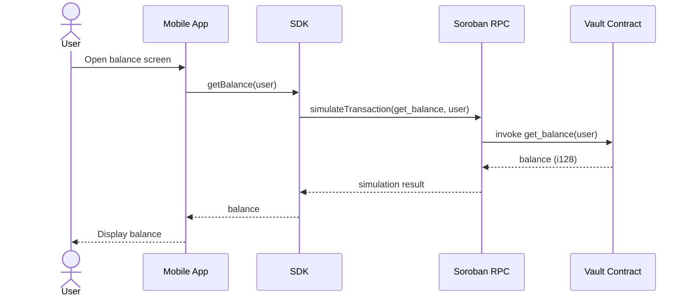
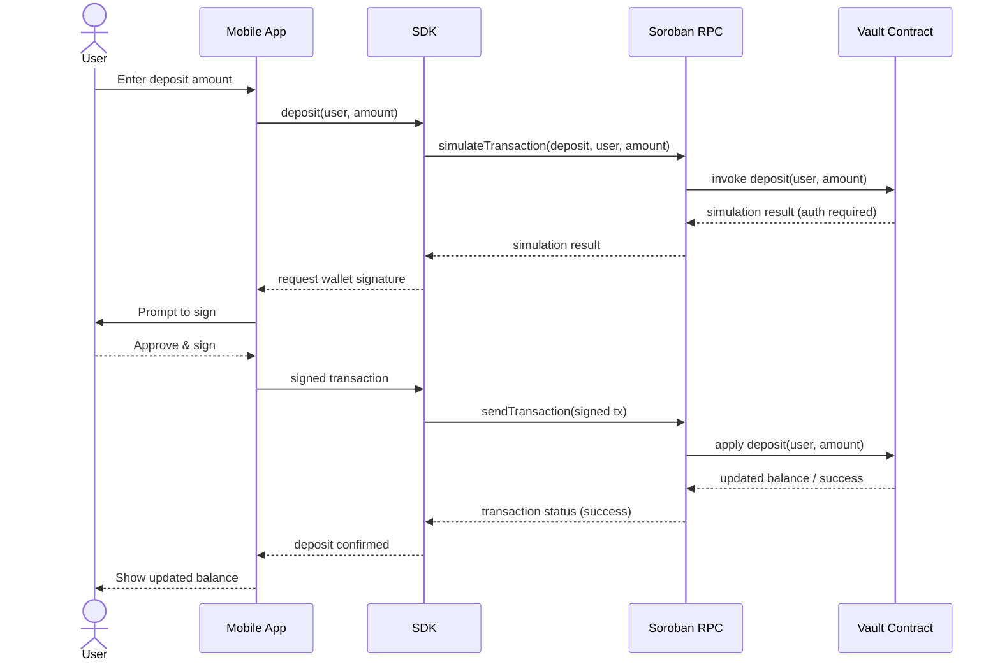
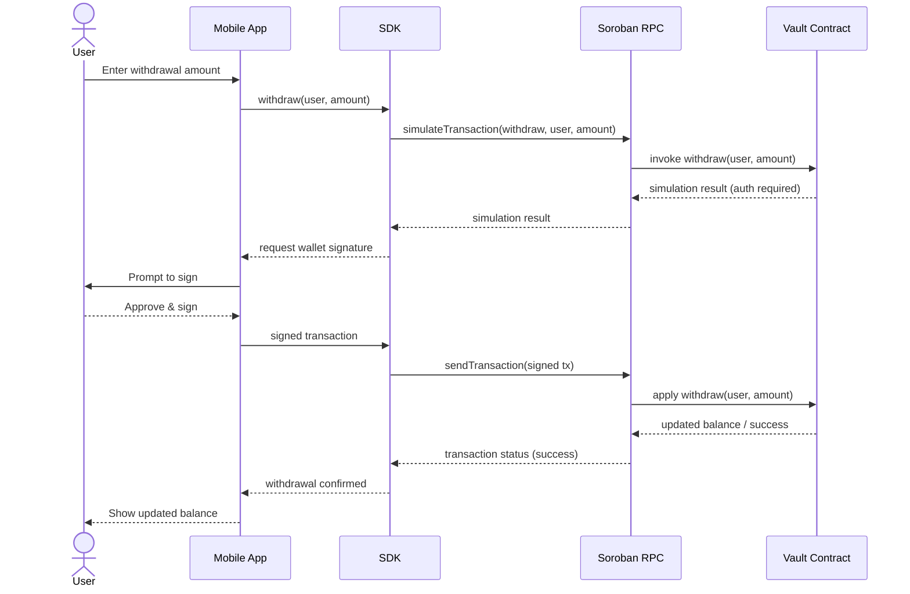
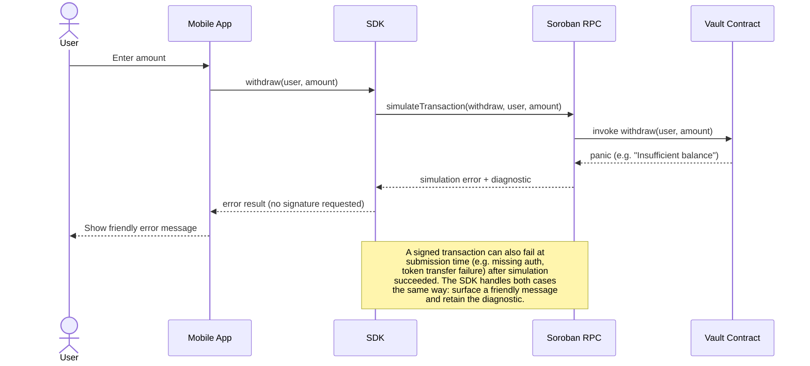

# SDK ↔ Contract Sequence Diagrams

This document shows how a vault request travels from the mobile app, through
the SDK, to Soroban RPC, and into the savings vault contract — and how the
response (or error) travels back. It complements
[architecture.md](architecture.md) (component responsibilities) and
[error-codes.md](error-codes.md) (failure conditions), which describe each
piece individually rather than as one end-to-end flow.

The diagrams are intentionally high level: they show the shape of each flow,
not every parameter or SDK method name, so they should not need updates for
routine contract changes. Update them only if a step is added, removed, or
reordered (for example, a new custody/token-transfer hop).

## Actors

- **Mobile App** — the end-user-facing client (UI, wallet signing prompts).
- **SDK** — the client library the mobile app calls; builds and simulates
  transactions, and abstracts contract invocation details.
- **Soroban RPC** — the network endpoint the SDK talks to for simulation,
  submission, and transaction status.
- **Vault Contract** — the deployed savings vault contract described in
  [architecture.md](architecture.md).

## Read-only balance query

`get_balance` (and similarly `get_locked_balance`, `can_withdraw`) is a
read-only call: it does not require the user's authorization or a signed
transaction.

## Deposit

`deposit` is a state-changing call: it requires the user's signature and a
submitted (not just simulated) transaction. Note that a successful deposit
updates the vault's **internal accounting only**; see the deposit/custody
limitation in [architecture.md](architecture.md#internal-balance-tracking-and-asset-custody).

## Withdraw

`withdraw` follows the same signed-transaction shape as deposit, but can fail
against vault-side checks (for example, insufficient available balance) in
addition to token-transfer failures. See
[error-codes.md](error-codes.md#insufficient-balance-errors).

## Error response path

Failures can surface at simulation time (before any signature is requested)
or at submission time (after a signed transaction is sent). The SDK should
retain the full diagnostic and avoid branching on panic text, per
[error-codes.md](error-codes.md).

## See also

- [Architecture Documentation](architecture.md) — component responsibilities
  and storage design.
- [Savings Vault Error Reference](error-codes.md) — current failure
  conditions and caller guidance.
- [Vault Contract ID Handoff](contract-id-handoff.md) — how the contract ID
  reaches the SDK and mobile app configuration.
